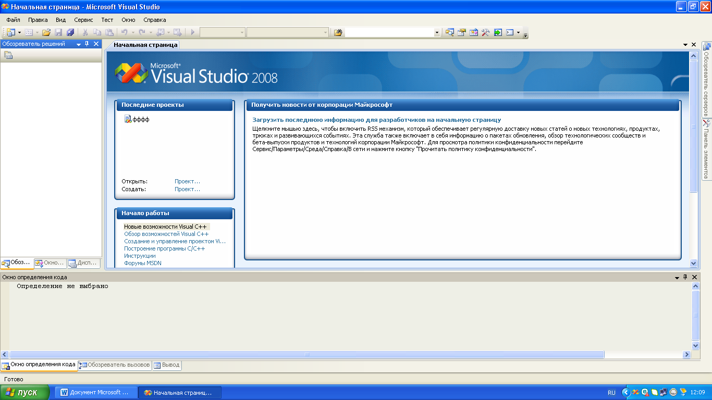
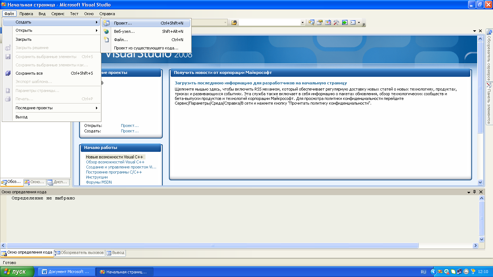
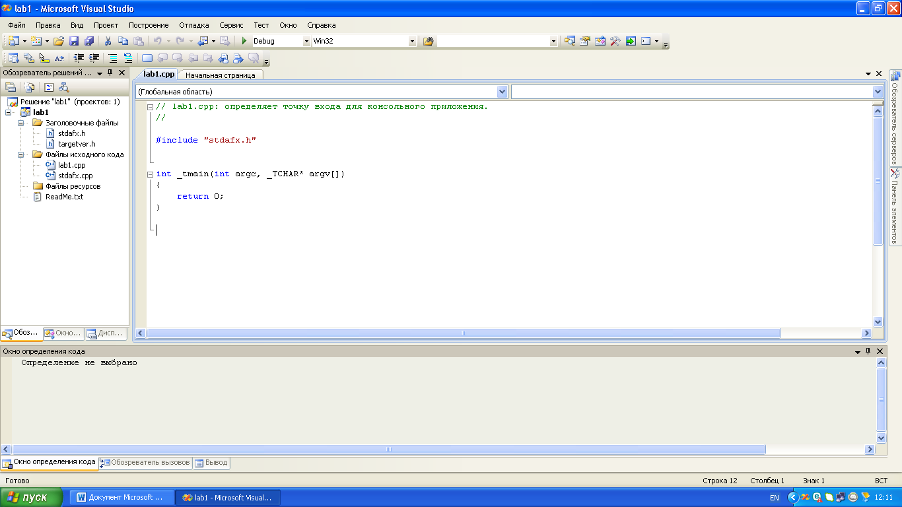
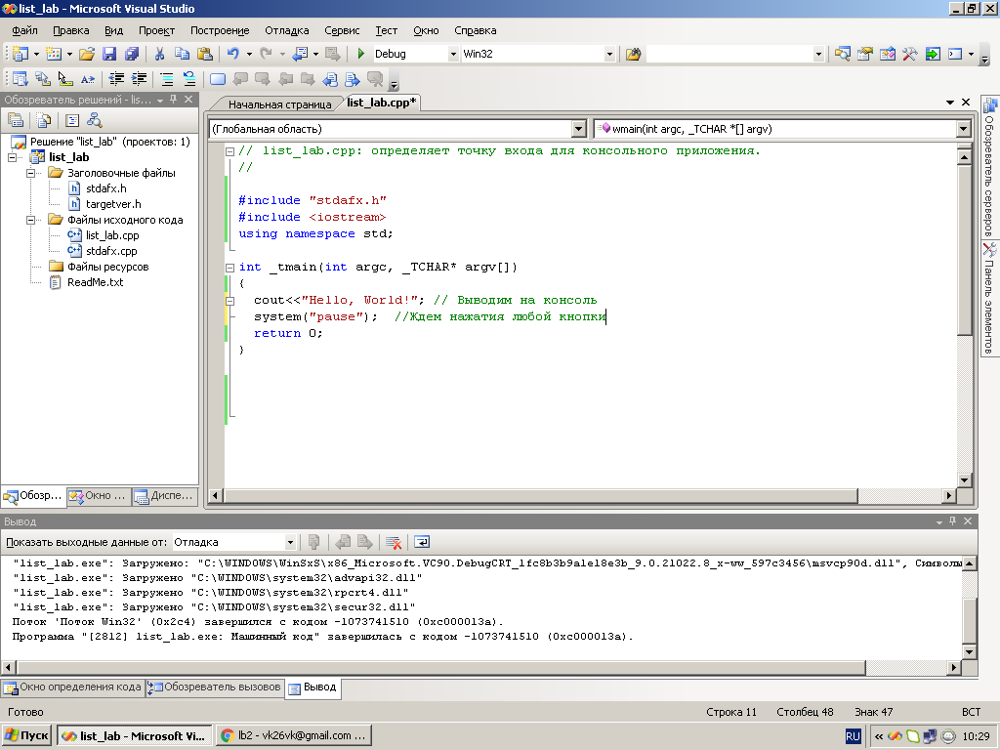
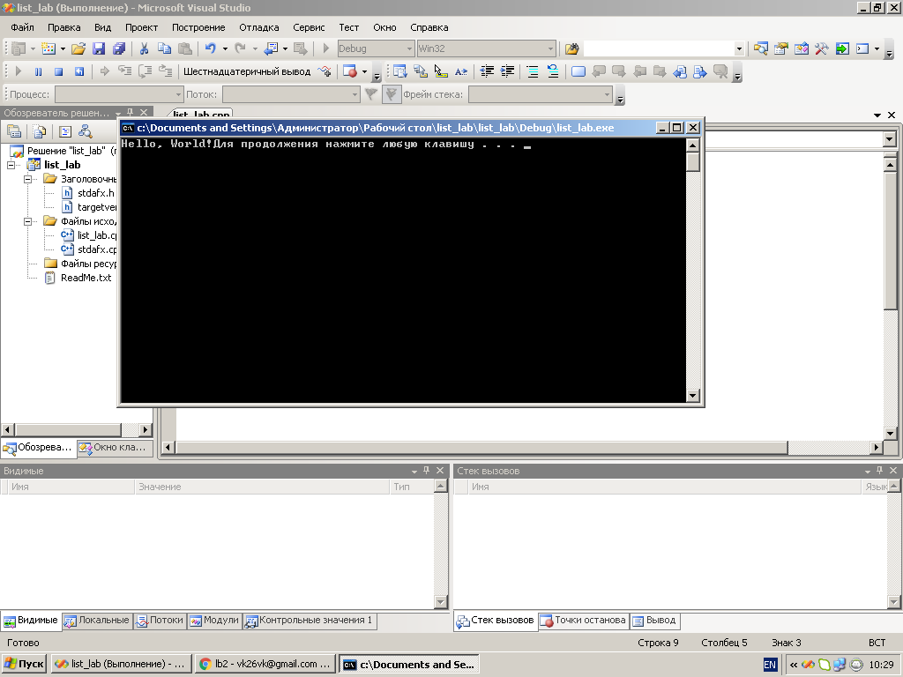
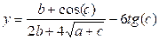

[Перелік усіх робіт](README.md)

# 01. Створення лінійної програми. Введення-виведення даних

## Мета роботи 

Ознайомитись з IDE Visual Studio. Навчитися створювати проект. Здобути навички у знаходженнi мінімального і максимального значення в масиві.
Обладнання та ПЗ: персональний комп’ютер, Visual Studio 2008.

## Теоретичні відомості

### Компілятори С++

### Середовища розробки

## Обладнання

Персональний комп’ютер, Visual Studio 2008 або інша середа розробки для мови C++

## Хід роботи

1. Завантажити програму Visual Studio 2008. Знайдіть на робочому столі ярлик з Visual Studio 2008 або Пуск → Всі програми → Microsoft → Microsoft Visual Studio 2008.
2.	Ознайомитися з інтерфейсом Visual Studio 2008.



3.	Створити новий проект «Visual C++ (консольное приложение Win32)». Для того щоб створити новий проект в головному меню виберемо Файл → Cтворити → Проект. Далі виберемо мову програмування «Visual C++» і тип проекту «Консольное приложение Win32». Введемо ім'я проекту і вкажемо розташування файлів проекту. Натиснемо «ОК», в наступному вікні необхідно натиснути «Готово».






4.	Приклад створення програми «Hello, World» 



5.	Приклад виконання програми «Hello, World» 



6.	Перевірити програму, що обчислює вираз  та скласти блок-схему
```cpp
#include "stdafx.h"
#include <iostream>
#include <conio.h>
#include <math.h>
using namespace std;
void main()
{
	float a,b,c,y;
	cout<<"Enter a, b, c: ";
	cin>>a>>b>>c;
	y=tan(c)-sqrt(b/c+a);
	cout<<"\n y="<<y;
	getch();  
}
```
7.	Написати програму, що обчислює вираз  та скласти блок-схему

8. Скласти звіт про роботу та відповісти на контрольні питання

## Контрольні питання

1.	Правила запису ідентифікаторів
2.	Призначення констант
3.	Призначенния конструкцій cin та cout
4.	Охарактеризувати тип int

## Довідники та додаткові матеріали
