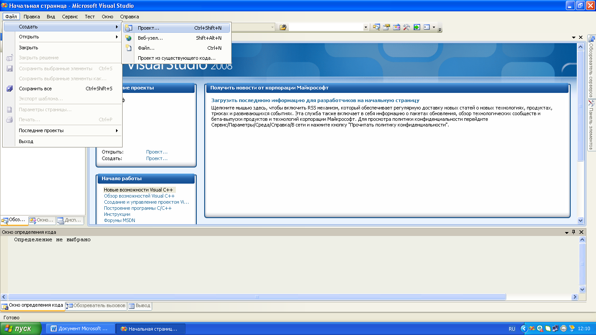

# 01. Створення лінійної програми. Введення-виведення даних

[Перелік усіх робіт](README.md)

## Мета роботи 

Ознайомитись з IDE Visual Studio. Навчитися створювати проект. Здобути навички у знаходженнi мінімального і максимального значення в масиві.
Обладнання та ПЗ: персональний комп’ютер, Visual Studio 2008.

## Теоретичні відомості

### Компілятори С++

### Середовища розробки

## Обладнання

Персональний комп’ютер, Visual Studio 2008 або інша середа розробки для мови C++

## Хід роботи

1. Завантажити програму Visual Studio 2008. Знайдіть на робочому столі ярлик з Visual Studio 2008 або Пуск → Всі програми → Microsoft → Microsoft Visual Studio 2008.
2.	Ознайомитися з інтерфейсом Visual Studio 2008.


3.	Створити новий проект «Visual C++ (консольное приложение Win32)». Для того щоб створити новий проект в головному меню виберемо Файл → Cтворити → Проект. Далі виберемо мову програмування «Visual C++» і тип проекту «Консольное приложение Win32». Введемо ім'я проекту і вкажемо розташування файлів проекту. Натиснемо «ОК», в наступному вікні необхідно натиснути «Готово».




4.	Приклад створення програми «Hello, World» 


5.	Приклад виконання програми «Hello, World» 


6.	Перевірити програму, що обчислює вираз $$ y = tan(c) - \sqrt{\frac{b}{c}+a} $$ та скласти блок-схему

```cpp
#include "stdafx.h"
#include <iostream>
#include <conio.h>
#include <math.h>
using namespace std;
void main()
{
	float a,b,c,y;
	cout<<"Enter a, b, c: ";
	cin>>a>>b>>c;
	y=tan(c)-sqrt(b/c+a);
	cout<<"\n y="<<y;
	getch();  
}
```

7.	Написати програму, що обчислює вираз  та скласти блок-схему

8.  Написати програму для обчислення завдання згідно з варіантом
	
    Варіант 1. Дано двозначне число. Знайти суму і частку його цифр.
    
	Варіант 2. Дано двозначне число. Вивести число, отримане при перестановці цифр
	вихідного числа.
	
    Варіант 3. Дано тризначне число. Використовуючи одну операцію цілочисельного
	ділення, вивести першу цифру даного числа (сотні) і другу цифру (десятки).
	
    Варіант 4. Дано тризначне число. Вивести спочатку його останню цифру (одиниці), а
	потім - його середню цифру (десятки).
	
    Варіант 5. Дано тризначне число. Знайти суму і добуток його цифр.
	
    Варіант 6. Дано тризначне число. Вивести число, отримане при прочитанні вихідного
	числа справа наліво.
	
    Варіант 7. Дано тризначне число. У ньому закреслили першу зліва цифру і приписали її
	справа. Вивести отримане число.
	
    Варіант 8. Дано тризначне число. У ньому закреслили першу праворуч цифру і
	приписали її зліва. Вивести отримане число.
	
    Варіант 9. Дано тризначне число. Вивести число, отримане при перестановці цифр
	сотень і десятків вихідного числа (наприклад, 123 перейде в 213).
	
    Варіант 10. Дано ціле число, більше 999. Використовуючи одну операцію ділення і одну
	операцію взят


9. Скласти звіт про роботу та відповісти на контрольні питання. Додати у звіт код програм, намалювати блоксхеми
10. Зберегти звіт у форматі PDF та надати викладачу на перевірку.

## Контрольні питання

1.	Правила запису ідентифікаторів
2.	Призначення констант
3.	Призначенния конструкцій cin та cout
4.	Охарактеризувати тип int
5.  Які типи даних можуть зберігати числа з дробовою частиною?
6.  Чим відрізняється операція ділення '10.0/2' від '10/2'?
7.  Яку іункцію виконує оператор `%`?

## Довідники та додаткові матеріали

1. [Написання першої програми на С++](https://codeguida.com/post/668/) 
2. [Написання простої лінійної програми на мові С++](https://stud.com.ua/254838/programuvannia/napysannia-prohramy-na-movie-c-yak-napisaty-prostu-linijnu-prohramu) 
3. [Створення першої програми на С++ в Linux](https://code-maven.com/create-your-first-c-plus-plus-program-on-linux) [Написання першої програми на С++](https://studway.com.ua/cplusplus/persha-programa-na-c-) 
4. [Написання першої програми на С++](https://uchitelya.com/programming/cpp/first-program) 
5. [Writing your first C++ program - Hello World example](https://www.geeksforgeeks.org/writing-first-c-program-hello-world-example/) 
6. [Learn C](https://www.learn-c.org/) 
7. [Codecademy - Learn C++](https://www.codecademy.com/learn/learn-c-plus-plus) 
8. [C++ Examples](https://www.programiz.com/cpp-programming/examples) 
9. [C++ Basic Syntax](https://www.tutorialspoint.com/cplusplus/cpp_basic_syntax.htm)