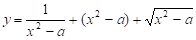
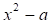
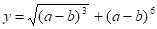
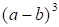
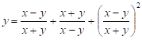
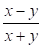
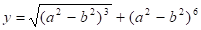
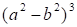
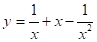

[Перелік усіх робіт](README.md)

# 11. Створення користувацькийх функцій та бібліотек

## Мета роботи 

Отримати навички роботи з функціями у мовах програмування C та С++, навчитися користуватися прототипами функцій

## Обладнання

Персональний комп’ютер, Visual Studio 2008 або інша середа розробки для мови C++

## Теоретичні відомості

Усі функції мають однакову структуру визначення у вигляді:
```
[тип результату] ім'я функції ([список формальних аргументів])
{ // тіло функції
	опис даних;
	оператори;
	[return] [вираз];
};// кінець тіла функції
```
Оголошення функції (прототип, заголовок) задає ім'я функції, тип значення, що повертає функція (якщо воно є), а також імена та типи аргументів, які можуть передаватися як у функцію, так і з неї. Визначення функції — це задання способу виконання операцій.

```cpp
double sqr (double); // прототип функції sqr()

main( ) // головна функція
{ // виклик функції sqr()
	cout << "Квадрат числа=" << sqr (10) << endl;
}

double sqr (double p) //-- функция sqr()
{ 
	return p*p; // повернення значення
} 

```

## Хід роботи

1. Завантажити Visual Studio 2008. Знайдіть на робочому столі ярлик з Visual Studio 2008 або Пуск → Всі програми→ Microsoft → Microsoft Visual Studio 2008.

2. Створити новий проект «Visual C++ (консольное приложение Win32)». Файл → Cтворити → Проект, тип проекту «Консольное приложение Win32».

3. Написати дві програми для обчислення виразу згідно з варіантом. Вказану частину виразу обчислити за допомогою функції.

	1.  для обчислення підвиразу  створити функцію 
	1.  для обчислення підвиразу  створити функцію 
	1.  для обчислення підвиразу  створити функцію 
	1.  для обчислення підвиразу  створити функцію 
	1.  для обчислення підвиразу  створити функцію 


## Контрольні питання

1. Яке призначення функції?
2. Напишіть загальний вигляд опису та оголошення функції:
3. Яке призначення оголошення функції?
4. Яке призначення типу void? 

## Довідники та додаткові матеріали