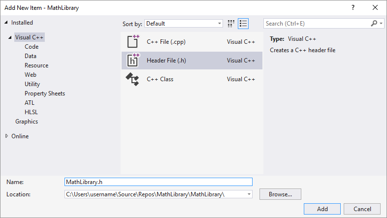
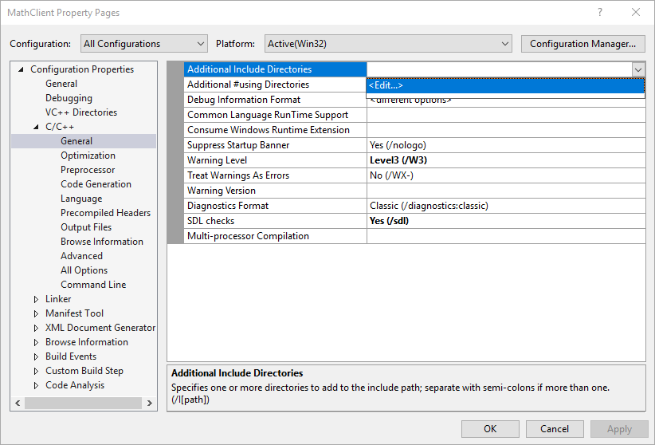

[Перелік усіх робіт](README.md)

# 12. Створення та використання DLL у C++

## Мета роботи 


## Обладнання

Персональний комп’ютер, Visual Studio 2008 або інша середа розробки для мови C++

## Хід роботи

1. У рядку меню виберіть "Файл" > "Створити" > "Проект", щоб відкрити діалогове вікно "Створення нового проекту".

    

2. У верхній частині діалогового вікна встановіть для Language значення C++, для Platform - Windows і для Project type значення Library.
3. У відфільтрованому списку типів проектів виберіть бібліотеку (DLL), що динамічно підключається, а потім натисніть кнопку «Далі».
4. На сторінці "Налаштування нового проекту" введіть MathLibrary у поле "Ім'я проекту", щоб вказати ім'я проекту. Залишіть значення за замовчуванням для розташування та імені рішення. Встановіть для «Рішення» значення «Створити нове рішення». Зніміть прапорець **Помістити рішення та проект у тому самому каталозі**, якщо він встановлений.
5. Натисніть кнопку «Створити», щоб створити проект.
Після створення рішення ви можете побачити створений проект та вихідні файли у вікні браузера рішень у Visual Studio.
    
    

Зараз ця DLL мало що робить. Потім ви створите файл заголовка для оголошення функцій, що експортуються до DLL, а потім додайте визначення функцій в DLL, щоб зробити його більш корисним.

### Додавання файлу заголовка в DLL

1. Щоб створити файл заголовка для ваших функцій, у рядку меню виберіть "Проект" > "Додати новий елемент".
2. У діалоговому вікні «Додати новий елемент» на лівій панелі виберіть Visual C++. На центральній панелі виберіть Header File(.h). Вкажіть MathLibrary.h як ім'я файлу заголовка.

    

3. Натисніть кнопку "Додати", щоб створити порожній файл заголовка, який відображається в новому вікні редактора.

    

4. Замініть вміст файлу заголовків цим кодом:
```cpp
// MathLibrary.h - Contains declarations of math functions
#pragma once

#ifdef MATHLIBRARY_EXPORTS
#define MATHLIBRARY_API __declspec(dllexport)
#else
#define MATHLIBRARY_API __declspec(dllimport)
#endif

// The Fibonacci recurrence relation describes a sequence F
// where F(n) is { n = 0, a
//               { n = 1, b
//               { n > 1, F(n-2) + F(n-1)
// for some initial integral values a and b.
// If the sequence is initialized F(0) = 1, F(1) = 1,
// then this relation produces the well-known Fibonacci
// sequence: 1, 1, 2, 3, 5, 8, 13, 21, 34, ...

// Initialize a Fibonacci relation sequence
// such that F(0) = a, F(1) = b.
// This function must be called before any other function.
extern "C" MATHLIBRARY_API void fibonacci_init(
    const unsigned long long a, const unsigned long long b);

// Produce the next value in the sequence.
// Returns true on success and updates current value and index;
// false on overflow, leaves current value and index unchanged.
extern "C" MATHLIBRARY_API bool fibonacci_next();

// Get the current value in the sequence.
extern "C" MATHLIBRARY_API unsigned long long fibonacci_current();

// Get the position of the current value in the sequence.
extern "C" MATHLIBRARY_API unsigned fibonacci_index();
```
У цьому файлі заголовка оголошуються деякі функції для створення узагальненої послідовності Фібоначчі з двома початковими значеннями. Виклик fibonacci_init (1, 1) генерує знайому послідовність чисел Фібоначчі.

### Додавання implementation DLL

1. У браузері рішень клацніть правою кнопкою миші вузол «Вихідні файли» і виберіть «Додати» > «Новий елемент». Створіть новий файл .cpp з ім'ям MathLibrary.cpp так само, як ви додавали новий файл заголовка на попередньому кроці.
2. У вікні редактора виберіть вкладку MathLibrary.cpp, якщо вона вже відкрита. В іншому випадку в браузері рішень двічі клацніть MathLibrary.cpp у папці «Вихідні файли» проекту MathLibrary, щоб відкрити його.
3. У редакторі замініть вміст файлу Math Library.cpp наступним кодом:
```cpp
// MathLibrary.cpp : Defines the exported functions for the DLL.
#include "pch.h" // use stdafx.h in Visual Studio 2017 and earlier
#include <utility>
#include <limits.h>
#include "MathLibrary.h"

// DLL internal state variables:
static unsigned long long previous_;  // Previous value, if any
static unsigned long long current_;   // Current sequence value
static unsigned index_;               // Current seq. position

// Initialize a Fibonacci relation sequence
// such that F(0) = a, F(1) = b.
// This function must be called before any other function.
void fibonacci_init(
    const unsigned long long a,
    const unsigned long long b)
{
    index_ = 0;
    current_ = a;
    previous_ = b; // see special case when initialized
}

// Produce the next value in the sequence.
// Returns true on success, false on overflow.
bool fibonacci_next()
{
    // check to see if we'd overflow result or position
    if ((ULLONG_MAX - previous_ < current_) ||
        (UINT_MAX == index_))
    {
        return false;
    }

    // Special case when index == 0, just return b value
    if (index_ > 0)
    {
        // otherwise, calculate next sequence value
        previous_ += current_;
    }
    std::swap(current_, previous_);
    ++index_;
    return true;
}

// Get the current value in the sequence.
unsigned long long fibonacci_current()
{
    return current_;
}

// Get the current index position in the sequence.
unsigned fibonacci_index()
{
    return index_;
}
```
Щоб переконатися, що все працює, скомпілюйте бібліотеку динамічного компонування. Для компіляції оберіть «Build» > «Зібрати рішення» у рядку меню. DLL і відповідний висновок компілятора розміщуються в папці Debug безпосередньо під папкою рішення. Якщо ви створюєте складання Release, вихідні дані розміщуються в папці з ім'ям Release.

### Створення client app у Visual Studio

1. У рядку меню виберіть "Файл" > "Створити" > "Проект", щоб відкрити діалогове вікно "Створення нового проекту".
2. У верхній частині діалогового вікна встановіть для параметра Language значення C++, встановіть для параметра Platform значення Windows і встановіть для параметра Project type значення Console.
3. У відфільтрованому списку типів проектів виберіть «Console App», потім натисніть «Далі».
4. На сторінці "Налаштування нового проекту" введіть MathClient у поле "Ім'я проекту", щоб вказати ім'я проекту. Залишіть значення за замовчуванням для розташування та імені рішення. Встановіть для «Рішення» значення «Створити нове рішення». Зніміть прапорець **Помістити рішення та проект у тому самому каталозі**, якщо він встановлений.

    

5. Натисніть кнопку «Створити», щоб створити client app.

### Додавання заголовку DLL у шлях включення

1. Клацніть правою кнопкою миші вузол MathClient у браузері рішень, щоб відкрити діалогове вікно "Сторінки властивостей".
2. У списку «Конфігурація» виберіть «Всі конфігурації», якщо він ще не вибраний.
3. На лівій панелі виберіть Властивості конфігурації> C/C++> Загальні.
4. На панелі властивостей виберіть елемент керування, що розкривається, поруч із полем редагування **Additional Include Directories**, а потім виберіть «Змінити».

    

5. Двічі клацніть у верхній панелі діалогового вікна «Додаткові каталоги включення», щоб увімкнути елемент керування редагуванням. Або виберіть піктограму папки, щоб створити новий запис.
6. У полі редагування вкажіть шлях до розташування файлу заголовка MathLibrary.h. Ви можете вибрати елемент керування з трьома крапками (...), щоб перейти до потрібної папки.
Коли DLL та клієнтські проекти знаходяться в інших папках, відкоригуйте відносний шлях, щоб вони збігалися. Або використовуйте крапку, щоб знайти папку.

    

7. Після того, як ви ввели шлях до файлу заголовка в діалоговому вікні «Additional Include Directories», натисніть кнопку «ОК». У діалоговому вікні "Property Pages" натисніть кнопку ОК, щоб зберегти зміни.

### Додавання до проекту бібліотеки DLL

1. Клацніть правою кнопкою миші вузол MathClient у браузері рішень і виберіть «Властивості», щоб відкрити діалогове вікно «Сторінки властивостей».
2. У розкривному списку «Конфігурація» виберіть «Всі конфігурації», якщо він ще не вибраний. Це гарантує, що будь-які зміни властивостей застосовуються як до складання налагодження, так і до складання випуску.
3. На лівій панелі виберіть пункт Властивості конфігурації > Компонувальник > Введення. На панелі властивостей виберіть елемент керування, що розкривається, поруч із полем редагування «Додаткові залежності», а потім виберіть «Змінити».

    

4. У діалоговому вікні «Додаткові залежності» додайте MathLibrary.lib до списку у верхньому полі редагування.

    

5. Натисніть кнопку «ОК», щоб повернутися до діалогового вікна «Сторінки властивостей».
6. На лівій панелі виберіть пункт Властивості конфігурації > Компонувальник > Загальні. На панелі властивостей виберіть елемент керування, що розкривається, поруч із полем редагування Додаткові каталоги бібліотеки, а потім виберіть «Змінити».

    

7. Двічі клацніть у верхній панелі діалогового вікна Additional Library Directories , щоб увімкнути елемент керування редагуванням. У полі редагування вкажіть шлях до файлу MathLibrary.lib. За замовчуванням він знаходиться у папці Debug безпосередньо під папкою DLL. Якщо ви створюєте збірку випуску, файл міститься в папці з ім'ям Release. Ви можете використовувати макрос $ (IntDir), щоб компонувальник міг знайти вашу DLL, незалежно від того, яку збірку ви створюєте. Якщо ви дотримуєтеся інструкцій з розміщення клієнтського проекту в окремому рішенні від проекту DLL, відносний шлях має виглядати так:
```
..\..\MathLibrary\$(IntDir)
```
Якщо ваша бібліотека DLL та клієнтські проекти знаходяться в інших місцях, відкоригуйте відносний шлях, щоб вони збігалися.

    

8. Після того, як ви ввели шлях до файлу бібліотеки у діалоговому вікні «Additional Library Directories», натисніть кнопку «ОК», щоб повернутися до діалогового вікна «Сторінки властивостей». Натисніть кнопку ОК, щоб зберегти зміни властивостей.

Тепер ваш клієнтський додаток може успішно компілюватися та зв'язуватися, але в нього, як і раніше, немає всього, що потрібно для запуску. Коли операційна система завантажує вашу програму, вона шукає бібліотеку DLL MathLibrary. Якщо він не може знайти DLL у певних системних каталогах, у дорозі до середовища або локального каталогу програми, завантаження не виконується. Залежно від операційної системи ви побачите таке повідомлення про помилку:


Один із способів уникнути цієї проблеми - скопіювати DLL в каталог, що містить файл вашого клієнта, що виконується, як частина процесу складання. Ви можете додати подію після збирання у свій проект, щоб додати команду, яка копіює DLL у вихідний каталог збирання. Вказана команда копіює DLL тільки в тому випадку, якщо вона відсутня або була змінена. Він використовує макроси для копіювання в місця налагодження або випуску та назад залежно від конфігурації складання.

### Копіювання DLL в post-build event

1. Клацніть правою кнопкою миші вузол MathClient у браузері рішень і виберіть «Властивості», щоб відкрити діалогове вікно «Сторінки властивостей».
2. У розкривному списку «Конфігурація» виберіть «Всі конфігурації», якщо він ще не вибраний.
3. На лівій панелі виберіть пункт Властивості конфігурації > Build Events > Post-Build Event.
4. На панелі властивостей оберіть елемент керування для редагування в полі Command Line. Якщо ви виконуєте інструкції з розміщення клієнтського проекту в окремому рішенні від проекту DLL, введіть наступну команду:
```
xcopy /y /d "..\..\MathLibrary\$(IntDir)MathLibrary.dll" "$(OutDir)"
```
Якщо ваші DLL та клієнтські проекти знаходяться в інших каталогах, змініть відносний шлях до DLL, щоб він відповідав.

   

5. Натисніть кнопку ОК, щоб зберегти зміни у властивостях проекту.

Тепер у вашому клієнтському додатку є все необхідне для створення та запуску. Виконайте складання програми, вибравши «Складання» > «Побудувати рішення» у рядку меню. У вікні виводу Visual Studio має бути щось на кшталт наступного прикладу залежно від вашої версії Visual Studio:
```
1>------ Build started: Project: MathClient, Configuration: Debug Win32 ------
1>MathClient.cpp
1>MathClient.vcxproj -> C:\Users\username\Source\Repos\MathClient\Debug\MathClient.exe
1>1 File(s) copied
========== Build: 1 succeeded, 0 failed, 0 up-to-date, 0 skipped ==========
```
Вітаємо, ви створили програму, яка викликає функції у вашій DLL. Тепер запустіть програму, щоб побачити, що вона робить. У рядку меню виберіть «Налагодження» > «Почати без налагодження». Visual Studio відкриває командне вікно для запуску програми. Остання частина висновку має виглядати так:


## Контрольні запитання

## Довідники та додаткові матеріали

1. [Creating and using DLLs](https://docs.microsoft.com/en-us/cpp/build/creating-and-using-shared-libraries-dlls)
2. [Creating a C++ Win32 DLL](https://www.codeproject.com/Articles/28969/HowTo-Export-C-classes-from-a-DLL)
3. [Creating and using DLL in VC++](https://www.codeproject.com/Articles/28969/HowTo-Export-C-classes-from-a-DLL)
4. [DLL Tutorial For Beginners](https://www.youtube.com/watch?v=JG4NWXdZTJw)
5. [DLL Tutorial](https://www.tutorialspoint.com/what-is-a-dll-in-cplusplus) 
6. [Створення DLL бібліотек на мові С/C++](https://proselyte.net/tutorials/dll-c-cpp/)
2. [Створення DLL у C++](https://www.examland.com.ua/c-windows/c-dll)
3. [DLL (Dynamic Link Library) в C++.](https://studopedia.org/8-53086.html)
4. [DLL на C++ – вибір оптимального варіанту створення бібліотек](https://procpp.netlify.app/2017/07/17/dll-cpp/)
5. [C++ DLL у Visual Studio](https://cppstudio.com/post/5037/)