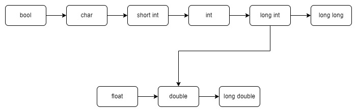

# Перетворення типів

[Перелік лекцій](README.md)

## Еквівалентність типів
Існує кілька схем для визначення того, чи є типи двох об'єктів еквівалентними. Дві схеми, найбільш часто використовувані, називаються структурна еквівалентність типів і іменна еквівалентність типів. У відповідності зі схемою структурної еквівалентності типів два об'єкти відносяться до одного і того ж типу тільки в тому випадку, якщо їх компоненти мають однакові типи. У відповідності зі схемою іменної еквівалентності типів два об'єкти мають один і той же тип тільки в разі їх визначення з використанням імені того ж типу.
Більшість реалізацій мови Сі використовують схему структурної еквівалентності типів. Однак в книзі (Ritche, D.M. 1980 / The C Programming Language - Reference Manual / AT & T Bell Laboratories, Murray Hill, N.J. 07974) питання про еквівалентність типів ігнорується, і за будь-якої реалізації може бути обрана своя схема визначення еквівалентності типів. Отже, цілком можливо, що результати правильно працюючої програми стануть невірними при заміні компілятора!

## Перетворення типів

### Неявні перетворення типів
Якщо вираз містить операнди різних вбудованих типів і немає явних наведень, компілятор використовує вбудовані стандартні перетворення для перетворення одного з операндів таким чином, щоб типи відповідали. Компілятор намагається виконати перетворення в чітко визначеній послідовності, доки не завершиться успішно. Якщо вибране перетворення є підвищенням, компілятор не попереджає. Якщо перетворення звужує, компілятор видає попередження про можливу втрату даних. Вказує, чи фактична втрата даних, залежить від фактичних значень, але рекомендується розглядати це попередження як помилку. Якщо використовується тип, що визначається користувачем, компілятор намагається використовувати перетворення, зазначені у визначенні класу. Якщо не вдається знайти допустиме перетворення, компілятор видає помилку та не компілює програму. 

Основні правила, що стосуються перетворення типів:

1.	Якщо операція виконується над даними двох різних типів, обидві величини наводяться до вищого з двох типів. Цей процес називається підвищенням типу.
2.	Послідовність імен типів, упорядкованих від вищого типу до нижчого, виглядає так: double, float, long, int, short, char. Використання ключового слова unsigned підвищує ранг відповідного типу даних зі знаком.
3.	В операторі присвоєння кінцевий результат обчислення виразу в правій частині приводиться до типу змінної, якій має бути присвоєно це значення. Даний процес може привести до підвищення типу, як описано вище, або до зниження, при якому величина приводиться до типу даних, яка має нижчий пріоритет.

### Розширення перетворень (підвищення рівня)
При розширенні перетворення значення меншої змінної призначається більшої змінної без втрати даних. Оскільки розширювальні перетворення завжди безпечні, компілятор виконує їх автоматично і попереджає. Наступні перетворення розширюються.




### Звуження перетворень (приведення)
Компілятор виконує перетворення, що неявно звужують, але попереджає про потенційну втрату даних. Прийміть ці попередження дуже серйозно. Якщо ви впевнені, що втрата даних не відбуватиметься, оскільки значення у більшій змінній завжди будуть відповідати меншій змінній, додайте явний привід, щоб компілятор більше не видає попередження. Якщо ви не впевнені, що перетворення безпечне, додайте в код певний вид середовища виконання перевірка для обробки можливої втрати даних, щоб вона не призводила до неправильного результату програми.

Будь-яке перетворення з типу з плаваючою комою в цілий тип є звужуючим перетворенням, так як дробова частина значення з плаваючою комою не карта і втрачена.


Підвищення типу зазвичай відбувається гладко, в той час як звуження може привести до ускладнень. Причина цього проста: все число цілком може не поміститися в елементі даних нижчого типу. Змінна типу char може мати ціле значення 101, але не 22225.
Приклад, наведений нижче, ілюструє застосування цих правил:

```cpp
/*перетворення*/
int main( )
{
	char ch;
	int i; 
	float f1;
	f1=i=ch='A'; /***8***/
	printf("ch=%c,i=%d,f1=%2.2f\n",ch,i,f1);
	ch=ch+1; /***10***/
	i=f1=f1+2*ch; /***11***/
	f1=2.0*ch+i; /***12***/
	printf("ch=%c,i=%d,f1=%2.2f\n",ch,i,f1);
	ch=2.0e30;/***14***/
	printf("Теперь ch=%c\n",ch);
}
```

Виконавши програму "перетворення", отримаємо такі результати:

```
ch=A,i=65,f1=65.00
ch=B,i=197,f1=329.00
Тепер ch=
```

Існує ще один вид перетворення типів. Для збереження точності обчислень при арифметичних операціях всі величини типу float перетворюються в дані типу double. Це істотно зменшує помилку округлення. Кінцевий результат перетворюється назад в число типу float, якщо це диктується відповідним оператором опису.
Операція приведення

Найкраще - це взагалі уникати перетворення типів, особливо в порядку убування рангу. Але іноді виявляється зручним застосовувати такі перетворення за умови, що ми ясно уявляємо сенс виконуваних дій. Перетворення типів, які ми обговорювали досі, виконувалися автоматично. Існує можливість точно вказувати тип даних, до якого необхідно привести величину. Цей спосіб називається приведенням типів, і використовується наступним чином: перед даною величиною в круглих дужках записується ім'я необхідного типу. Дужки і ім'я типу разом утворюють операцію приведення. У загальному вигляді вона записується так: `(тип)` де фактичне ім'я необхідного типу видається замість слова тип.
Розглянемо приклад:

```cpp
int nice;
nice = 1.6+1.7;
nice = (int)1.6+(int)1.7;
```
У першому прикладі використовується автоматичне перетворення типів. Спочатку числа 1.6 і 1.7 складаються - результат дорівнює 3.3. Потім шляхом відкидання дробової частини отримане число перетворюється в 3 для узгодження з типом int змінної nice. У другому прикладі 1.6 і 1.7 перетворюються в цілі числа 1, так що зміній  nice присвоюється значення, рівне 1 + 1, або 2.

Особливості роботи з мовою Сі. Ми не повинні змішувати типи; ось чому в деяких мовах це заборонено. Але бувають ситуації, коли це виявляється корисним. Філософія мови Сі полягає в тому, щоб не встановлювати бар'єрів на вашому шляху, але при цьому покласти на вас всю відповідальність за зловживання наданою свободою.
Неявне перетворення типу

Неявні перетворення типу виконуються головним чином для узгодження аргументів оператора або функції (якщо це можливо) зі значеннями, передбачуваними в цих операторах або функціях. Всі неявні перетворення типу, які можуть зустрітися, перераховані нижче (зліва вказується перетворений тип, а праворуч - список типів, в які він може бути перетворений):
char - int, short int, long int (Перетворення до значення з великим числом двійкових розрядів може включати, а може не включати розширення знакового розряду - це залежить від реалізації мови. Для елементів заданого набору знаків гарантується перетворення в невід'ємні цілі значення).

int - char, short int, long int ( перетворення до цілого більшої довжини включає розширення знакового розряду. Перетворення до цілого меншої довжини викликає відкидання зайвих старших розрядів). float, double, unsigned int (інтерпретація комбінації бітів у вигляді беззнакового цілого значення).

- short int - аналогічно типу int.
- long int - аналогічно типу int.
- float - double, int, short int, long int (машинно-залежне перетворення, якщо значення, яке потрібно занадто велике, то результат невизначений).
- double - float (перетворення з округленням і подальшим відкиданням зайвих розрядів), int, short int, long int.

## Арифметичне перетворення
Арифметичні оператори мови Сі перетворять операнди до відповідних типів автоматично, якщо операнди не мали таких типів з самого початку. Схема перетворення, використовувана цими операторами, називається зазвичай арифметичні перетворення; ця схема може бути описана наступними правилами:
1.	Претворити операнди типів char і short int до типу int ; Претворити операнди типу float до типу double.
2.	Якщо хоча б один з операндів має тип double, то й інший операнд перетворюється в тип double (якщо він іншого типу); результат має тип double.
3.	Якщо хоча б один з операнд має тип long, то й інший операнд перетворюється в тип long (якщо він іншого типу); результат має тип long.
4.	Якщо хоча б один з операндів має тип unsigned, то й інший операнд перетворюється в тип unsigned (якщо його тип не unsigned); результат має тип unsigned.
5.	Якщо ні один з випадків 1-4 не має місця, то обидва операнда повинні мати тип int ; такий же тип буде і у результату.

## Явне перетворення типів

За допомогою операції приведення можна вказати компілятору перетворити значення одного типу на інший тип. Компілятор викличе помилку в деяких випадках, якщо два типи повністю не пов'язані, але в інших випадках це не призведе до помилки, навіть якщо операція не є типобезпечною. Використовуйте приведення з розрідженим способом, оскільки будь-яке перетворення з одного типу на інший є потенційним джерелом помилки програми. 

Вирази можуть бути перетворені з одного типу в інший явним зазначенням. Вираз E може бути явно перетворено до типу ім'я-типу за допомогою запису виду 

`(ім’я_типу) Е`


У програмуванні в стилі C той самий оператор приведення в стилі C використовується для всіх видів приведення.

```cpp
(int) x; // old-style cast, old-style syntax
int(x); // old-style cast, functional syntax
```