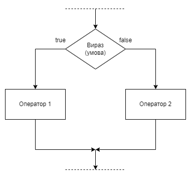
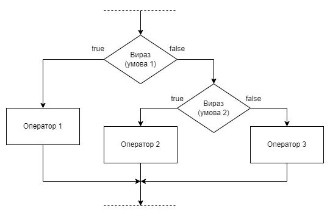

# Розгалуження

[Перелік лекцій](README.md)

## Узагальнено

Розгалуження (англ. branching) - це відхилення виконання програми на різні шляхи в залежності від певної умови або значення змінної.

В загальному випадку, розгалуження можна реалізувати за допомогою різних видів конструкцій у більшості мов програмування, наприклад:

- Умовні оператори (if/else, switch/case)
- Тернарний оператор
- Цикли з умовою виходу (while, do/while, for)
- Функції та процедури з умовним оператором у своєму тілі
- Прикладні бібліотеки з розгалуженням у своєму коді
  
У кожній з цих конструкцій залежно від умови може виконуватись різний блок коду. Використовуючи розгалуження, можна забезпечити більш гнучкий та динамічний контроль над ходом виконання програми.

## Оператор if...else

У C++, розгалуження - це процес прийняття рішення на основі умови. Це дозволяє програмістам створювати код, який може виконувати різні дії в залежності від різних умов.

У C++, розгалуження може бути здійснене з використанням ключових слів if, else, else if та switch. Розгалуження з if виконується наступним чином:

```cpp
if (умова) {
  // код, який виконується, якщо умова true
} else {
  // код, який виконується, якщо умова false
}
```



Пояснення до синтаксису:

- if - ключове слово, що починає умовний оператор;
- умова - булевий вираз, який повинен повернути true або false;
- {} - блок коду, який буде виконано, якщо умова буде true;
- else - ключове слово, яке позначає альтернативний блок коду, який буде виконано, якщо умова буде false;
- {} - блок коду, який буде виконано, якщо умова буде false.

При виконанні if-else, спочатку виконується блок коду, який відповідає умові. Якщо умова повертає true, виконується блок коду в фігурних дужках після if. Якщо умова повертає false, виконується блок коду в фігурних дужках після else.

Якщо потрібно виконати код ллише у разі істинної умови або не робити нічого, можна використовувати спрощений варіант if:

```cpp
if (умова1) {
  // код, який виконується, якщо умова1 true
} 
```


Однією з важливих особливостей розгалуження в C++ є можливість використовувати різні види розгалужень залежно від типу даних. 

Умова може бути будь-якого типу, що може бути відображено на булеву змінну, наприклад, int, float, char і т.д.

## Вкладені розгалуження

Вкладені розгалуження (nested branching) - це використання розгалужень всередині інших розгалужень у програмі. Це дозволяє вирішувати більш складні завдання, що вимагають більшого рівня управління програмним виконанням.

Варто дотримуватись наступних принципів використання вкладених розгалужень:

1. Використовуйте розгалуження з помітними умовами: Умова має бути простою, зрозумілою та необхідною для виконання коду всередині цього розгалуження.
2. Використовуйте вкладені розгалуження тільки тоді, коли це необхідно: Використовуйте вкладені розгалуження тільки тоді, коли це єдиний спосіб вирішити задачу.
3. Уникайте вкладених розгалужень глибше за 2-3 рівні: Вкладені розгалуження можуть зробити код складнішим для розуміння та управління. Тому краще уникати глибоких вкладень розгалужень.
4. Використовуйте функції замість вкладених розгалужень: Якщо вкладені розгалуження зроблять код надто складним, використайте функції для заміни вкладених розгалужень.

Наприклад, такий код містить вкладені розгалуження:

```cpp
if (a > b) {
   if (b > c) {
      // do something
   }
   else {
      // do something else
   }
}
else {
   // do something different
}
```
У цьому випадку можна переписати код, використовуючи тернарний оператор, щоб уникнути вкладених розгалужень:

```cpp
result = (a > b) ? ((b > c) ? x : y) : z;
```

Ішний приклад вкладеного розгалуження може виглядати наступним чином:

```cpp
if (умова1) {
  // код, який виконується, якщо умова1 true
} else if (умова2) {
  // код, який виконується, якщо умова2 true
} else {
  // код, який виконується, якщо всі умови false
}
```



## Оператор switch...case

Оператор switch-case є конструкцією розгалуження у мові програмування C++. Він дозволяє обрати одну з кількох гілок в залежності від значення деякого виразу. Синтаксис цього оператора наступний:

```cpp
switch (вираз) {
    case вираз1:
        // код, який виконується, якщо вираз == вираз1
        break;
    case вираз2:
        // код, який виконується, якщо вираз == вираз2
        break;
    //...
    default:
        // код, який виконується, якщо жоден з попередніх варіантів не співпав з виразом
}
```
Спочатку вираз використовується для визначення варіанту, який буде виконано. Після цього виконується код, що відповідає варіанту, який співпав з виразом. Кожна гілка коду завершується оператором break, який виходить із блоку switch. Якщо жоден варіант не співпадає зі значенням виразу, то виконується код в блоку default.

Оператор switch-case може бути корисним у випадках, коли потрібно здійснити різні дії залежно від значення змінної. Наприклад, якщо потрібно визначити, який день тижня є за введеним номером (1 - понеділок, 2 - вівторок і т.д.), то можна використати оператор switch-case.

Проте, варто пам'ятати, що занадто багато гілок у конструкції switch-case може зробити код складнішим для розуміння та підтримки. Також важливо не забувати про оператор break, оскільки його відсутність може призвести до неочікуваної поведінки програми.

## Тернарний оператор

Тернарний оператор - це спосіб скороченого запису умовного оператора if-else в мові C++.

Синтаксис тернарного оператора:

```cpp
умова ? значення1 : значення2;
```

Тернарний оператор складається з трьох частин:

- Умова: вираз, що повертає булеве значення (true або false).
- Значення1: значення, яке повертається, якщо умова виконується (true).
- Значення2: значення, яке повертається, якщо умова не виконується (false).
Якщо умова повертає true, то тернарний оператор поверне значення1, якщо false - значення2.

Приклад використання тернарного оператора:

```cpp
int a = 10, b = 5;
int max_val = (a > b) ? a : b; // max_val буде містити 10
```
У цьому прикладі, якщо a > b поверне true, то значенням max_val буде a (10), якщо false - то b (5). Таким чином, умовний оператор if-else можна замінити коротким записом з використанням тернарного оператора.

Важливо розуміти, що тернарний оператор не завжди є кращим вибором ніж if-else, і в деяких випадках if-else може бути більш зрозумілим та читабельним.

## Контрольні запитання

1. Який оператор умовного розгалуження в C++?
2. Що таке вкладені розгалуження?
3. Як можна замінити декілька операторів розгалуження одним switch-case оператором?
4. Що таке термінальне розгалуження?
5. Які умови відповідають true і false у розгалуженні?
6. Які аргументи приймає тернарний оператор?
7. Як можна використовувати тернарний оператор в розгалуженні?
8. Як тернарний оператор допомагає скоротити код?

## Посилання