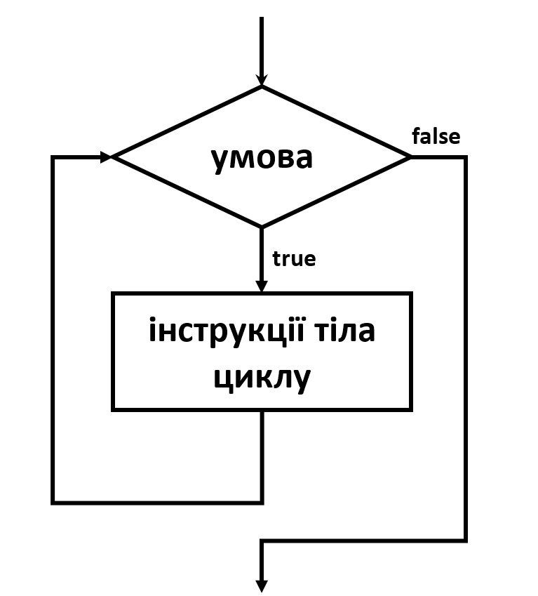
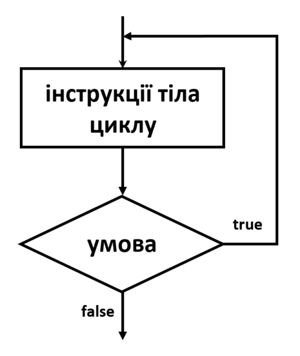

# Цикли ч.1

[Перелік лекцій](README.md)

## Цикл з передумовою
В С++ існує три види циклів: while, for и do. 

Цикл while Має наступну форму:

```cpp
while (e) s;
```

Оператор s виконується до тих пір, поки значення виразу e "істина". Значення e обчислюється перед кожним виконанням оператора s.



Розглянемо ще два приклади його роботи:

```cpp
#include <cstdio>

int main()
{
    int i = 1;
    char res;

    // Повідомлення для користувача
    std::printf("Задумайте ціле число від 1 до 100. Комп'ютер спробує вгадати його.\n");
    std::printf("Відповідайте 'y', якщо здогадка правильна, і 'n', якщо програма помиляється.\n");

    // Перша спроба вгадати число
    std::printf("Отже, ваше число %d?\n", i);

    // Отримання відповіді
    while ((res = std::getchar()) != 'y')
    {
        if (res != '\n')
        {
            // Пропуск символу нового рядка
            std::printf("Ну тоді воно дорівнює %d\n", ++i);
        }
    }

    // Вивід повідомлення про вгадування числа
    std::printf("Число вгадано!\n");

    return 0; // Кінець програми
}
```

Та сама програма, але на базі бібліотеки iostream

```cpp
#include <iostream>

int main()
{
    int i = 1;
    char res;

    // Повідомлення для користувача
    std::cout << "Задумайте ціле число від 1 до 100. Комп'ютер спробує вгадати його.\n";
    std::cout << "Відповідайте 'y', якщо здогадка правильна, і 'n', якщо програма помиляється.\n";

    // Перша спроба вгадати число
    std::cout << "Отже, ваше число " << i << "?\n";

    // Отримання відповіді
    while ((res = std::cin.get()) != 'y')
    {
        if (res != '\n')
        {
            // Пропуск символу нового рядка
            std::cout << "Ну тоді воно дорівнює " << ++i << "\n";
        }
    }

    // Вивід повідомлення про вгадування числа
    std::cout << "Число вгадано!\n";

    return 0; // Кінець програми
}
```

Це досить проста програма. Вона написана правильно і вирішує поставлене завдання, але робить це вкрай неефективно. Даний приклад показує, що правильність написання - не єдиний критерій, за яким необхідно оцінювати програму. При цьому дуже важлива її ефективність!

У наших прикладах досі використовувалися умовні вирази, але взагалі кажучи, це можуть бути вирази довільного типу. В якості оператора можна використовувати простий оператор з символом "крапка з комою" в кінці або складовий оператор, укладений у фігурні дужки. Якщо вираз істинний (або в загальному випадку дорівнює одиниці), то оператор, що входить в цикл while, виконується один раз, а потім вираз перевіряється знову.

Ця послідовність дій, що складається з перевірки та виконання оператора, періодично повторюється до тих пір, поки вираз не стане хибним (або в загальному випадку рівним нулю). Кожен такий крок називається ітерація. Дана структура аналогічна структурі оператора if. Основна відмінність полягає в тому, що в операторі if перевірка умови і (можливе) виконання оператора здійснюється тільки один раз, а в циклі while ці дії проводяться, взагалі кажучи, неодноразово.

При побудові циклу while ви повинні включити в нього якісь конструкції, що змінюють величину перевіряється вираження так, щоб врешті-решт воно стало хибним. В іншому випадку виконання циклу ніколи не завершиться.

Цикл while є умовним циклом, що використовує передумову, тобто умова на вході. Він називається умовним, тому що виконання оператора залежить від істинності умови, що описується за допомогою виразу. Подібний вираз задає передумова, оскільки виконання цієї умови має бути перевірено перед початком виконання тіла циклу.

Алгоритми і псевдокод. Покроковий процес, гарантовано приводить до бажаного результату, називається алгоритмом. Пропозиції, що не є пропозицією якоїсь мови програмування, хоча і дуже нагадує те, що ми пишемо на даній мові програмування, називають псевдокодом. 

Псевдокод дуже ефективний при розробці логіки програми. Після того як логіка здасться вам правильною, ви можете звернути особливу увагу на деталі перекладу псевдокоду на реальну мову програмування. Перевага використання псевдокоду полягає в тому, що він дозволяє сконцентруватися на логіці і структурі програми, не піклуючись поки про спосіб перекладу цих ідей на мову машини. Якщо ми хочемо поліпшити програму, нам в першу чергу необхідно поліпшити алгоритм!
Підведемо підсумки.

Оператор while визначає операції, які циклічно виконуються до тих пір, поки вираз що перевіряється не стане хибним, або рівним нулю.. Оператор while - це цикл з передумовою. Рішення, виконати в черговий раз тіло циклу, приймається перед початком його проходження. Тому цілком можливо, що тіло циклу не буде виконано жодного разу. Оператор, який утворює тіло циклу, може бути або простим, або складеним. Форма запису:
while (выражение) оператор

Виконання оператора циклічно повторюється до тих пір, поки вираз не стане хибним, або рівним нулю.

## Цикл з післяумовою

Цикл `do оператор while(e);` виконується до тих пір, поки вираз e має значення "істина". На відміну від циклу while, в якому перевірка умови закінчення циклу робиться до виконання тіла циклу, в циклі do така перевірка має місце після виконання тіла циклу. Отже, тіло циклу do буде виконано хоча б один раз, навіть якщо вираз e має значення "брехня" c самого початку. Цикл do аналогічний циклу repeat в мові Паскаль, відмінний від нього тільки тим , що цикл repeat виконується до тих пір, поки деяка умова виходу з циклу не стає істинною, а цикл do виконується весь час, поки деяка умова залишається істинним!

Цикл `do while` – це конструкція з умовою на виході.




Використовувати цикл do while найкраще в тих випадках, коли повинна бути виконана принаймні одна ітерація. Наприклад, ми могли б застосувати цикл do while в нашій програмі вгадування числа. На псевдокоді алгоритм роботи програми можна тоді записати в такий спосіб:

```
do {
висуньте припущення
отримаєте відповідь виду y,n
} while(Відповідь не співпадає з y);
```

Ви повинні уникати використання циклу do while, структура якого аналогічна представленій нижче операції: запитайте користувача, чи хоче він продовжувати
```
do
оператор
while (відповідь буде так)
```
В даному випадку, після того як користувач відповість "ні", "оператор" буде виконаний, оскільки перевірка здійснюється занадто пізно.
Приклад:

```cpp
do
	scanf("%d", &number);
while(number!=50);
```

Підведемо підсумки.

Оператор do while визначає дії, які циклічно виконуються до тих пір, поки вираз що перевіряється не стане хибним, або рівним нулю. Оператор do while - це цикл з постумовою. Рішення про те виконувати чи ні в черговий раз тіло циклу, приймається після його проходження. Тому тіло циклу буде виконано принаймні один раз. Оператор, який утворює тіло циклу, може бути як простим, так і складеним.

Особливості роботи з мовою СІ . Циклом якого виду найкраще скористатися? По-перше, вирішите, чи потрібен вам цикл з передумовою або ж з постумовою. Найчастіше вам потрібен буде цикл з передумовою. За оцінками Керніган і Рітчі, в середньому цикли з умовою поста становлять лише 5% загального числа використовуваних циклів. Існує кілька причин, за якими програмісти воліють користуватися циклами з передумовою. У їх числі один загальний принцип, згідно з яким краще подивитися, куди ви стрибаєте, до стрибка, а не після. Другим моментом є те, що програму легше читати, якщо умова яка перевіряється знаходиться на початку циклу. І нарешті, у багатьох випадках важливо, щоб тіло циклу ігнорувалося повністю, якщо умова спочатку не виконується.

Вкладені цикли. Вкладеним називається цикл, що знаходиться всередині іншого циклу.
Приклад:
```cpp
/* Просте число - це таке число, яке
ділиться без остачі тільки на 1 і саме на себе.
Першими простими числами будуть 2, 3, 5, 7 і 11. */
/*прості числа*/ 
#include <iostream>

int main()
{
    int number, divisor, limit;
    int count = 0;

    std::cout << "Вкажіть, будь ласка, верхню межу для пошуку простих чисел.\n";
    std::cout << "Верхня межа повинна бути 2 або більше.\n";

    std::cin >> limit;

    while (limit < 2)
    {
        // Якщо введено некоректне значення, повторити запит
        std::cout << "Ви були неуважні! Спробуйте ще раз.\n";
        std::cin >> limit;
    }

    std::cout << "Зараз надрукуємо прості числа!\n";

    for (number = 2; number <= limit; number++)
    {
        // Зовнішній цикл для перевірки простоти кожного числа
        for (divisor = 2; number % divisor != 0; divisor++)
            ;

        if (divisor == number)
        {
            // Якщо число є простим, вивести його
            std::cout << std::setw(5) << number;

            if (++count % 10 == 0)
                std::cout << "\n"; // Новий рядок кожні 10 простих чисел
        }
    }

    std::cout << "Робота завершена!\n";

    return 0; // Кінець програми
}
```
У зовнішньому циклі кожне число, починаючи з 2 і закінчуючи величиною limit, послідовно береться для перевірки. Зазначена перевірка здійснюється у внутрішньому циклі. У count зберігається лічильник одержуваних простих чисел. При друку кожне одинадцяте просте число друкується з нового рядка.

## Передчасний вихід із циклу

У С++, є кілька способів зупинити виконання циклу передчасно:

1. Використання оператора break - цей оператор зупиняє виконання циклу і переходить до наступної інструкції після циклу.
Наприклад:

```cpp
for (int i = 0; i < 10; i++) {
  if (i == 5) {
    break;
  }
  cout << i << endl;
}
```
2. Використання оператора goto - цей оператор дозволяє перескочити на мітку поза циклом.
Наприклад:

```cpp
for (int i = 0; i < 10; i++) {
  if (i == 5) {
    goto end;
  }
  cout << i << endl;
}
end:
```

3. Використання функції return - якщо цикл знаходиться в функції, можна використати return для виходу з функції та зупинки виконання циклу.
Наприклад:

```cpp
void myFunction() {
  for (int i = 0; i < 10; i++) {
    if (i == 5) {
      return;
    }
    cout << i << endl;
  }
}
```

4. Використання виключення - можна створити виключення та викинути його в середині циклу, щоб зупинити його виконання.
Наприклад:

```cpp
for (int i = 0; i < 10; i++) {
  if (i == 5) {
    throw "Stopped early";
  }
  cout << i << endl;
}
```

5. Використання флага - можна створити флаг і встановити його значення, коли необхідно зупинити виконання циклу.
Наприклад:

```cpp
bool stop = false;
for (int i = 0; i < 10 && !stop; i++) {
  if (i == 5) {
    stop = true;
  }
  cout << i << endl;
}
```

## Контрольні питання

1. Що таке цикл в програмуванні?
2. Які види циклів існують в програмуванні?
3. Як можна використовувати цикли в програмах?
4. Які інструкції керування використовуються в циклах?
5. Як можна запобігти зацикленню в програмах з циклами?
6. Як можна зупинити виконання циклу передчасно?
7. Як можна взаємодіяти зі змінними, які знаходяться в межах циклу, після завершення циклу?
8. Як можна відстежувати кількість ітерацій у циклі?